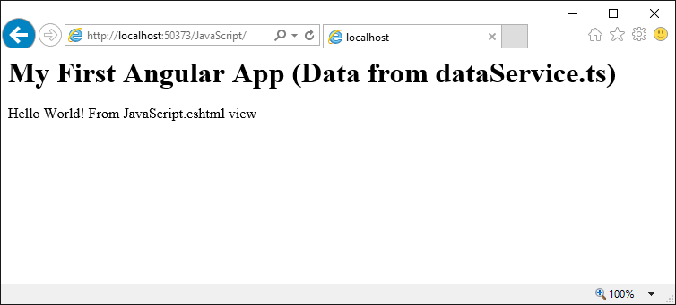

# ASP.NET Core Angular2 Server Side Rendering

## Install
* npm run installAll (Installs "Angular" and "Angular Universal" and "ASP.NET Core" and runs type script compile for "Angular")
* Open http://localhost:5000/Angular/Debug.html one time. (This copies all necessary files to "wwwroot/Angular")

## Build
* npm run buildAngular (Builds "Angular" and "Angular Universal" and copies file AngularUniversalServer.js to ASP.NET Core)

# File and folder description
Folder "node_modules"
- Used for server side rendering.

File "AngularUniversalServer.js"
- Is the output of "Angular Universal/dist/server/index.js"

Folder "wwwroot/Angular"
- Contains only necessary files for publish
- Gets populated when "AngularDebug.cshtml" runs the first time.

# ASP.NET Core Single Page Application with Node.js

Demonstrates ASP.NET Core calling JavaScript on server side via Node.js. It also passes data from ASP.NET down to Node.js. Example tested on Windows and Ubuntu.

## Prerequisites
* Visual Studio 2015 or Visual Code
* Node.js installed (nodejs.org)
* Npm installed (npmjs.com)
* Run “npm install” in folder “WebApplication”. This will download “node_modules”.

Hint: For Ubuntu check node version in terminal with “node --version”. You might have to install “sudo apt install nodejs-legacy”.

