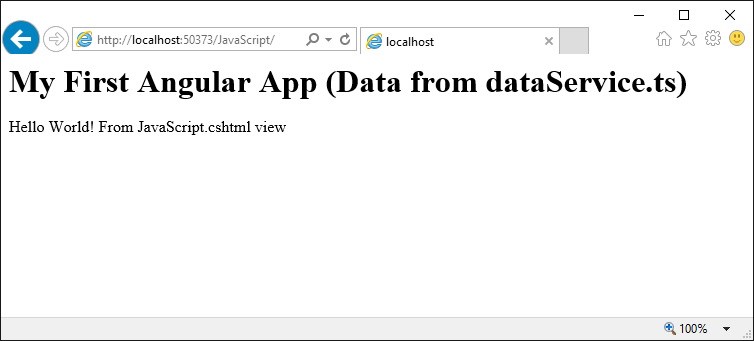

# Application Framework Basics
Minimal ASP.NET Core application with Angular2 Universal. Demonstrates transition from server side rendering to single page application. It also passes data from ASP.NET down to Node.js. Example tested on Windows and Ubuntu.

## Install
Go to folder "ASP.NET"
* npm run installAll (Installs "Angular" and "Angular Universal" and "ASP.NET" and runs type script compile for "Angular")
* Open Solution.sln with Visual Studio or Visual Studio Code (and restore .NET packages) and run it.
* Open http://localhost:50373/Angular/InstallClient.html one time. (This copies all necessary files to "wwwroot/Angular")

## Folder Structure
* Angular (Based on angular.io quickstart)
* Angular Universal (Based on Angular Universal starter)
* ASP.NET (Single page application)

## Folder "Angular"
Develop client code here. It transforms the data object (See also file dataService.ts) into html.

## Folder "Angular Universal"
Do not change any code here.

## Folder "ASP.NET"
Open with Visual Studio or Visual Studio Code. It contains everything to build and publish.

## Folder Structure (node_modules)
* ASP.NET/node_modules (Used for asp-prerender-module in (*.cshtml) files)
* ASP.NET/Application/Node.js/Client/node_modules (Used for single page application client)
* ASP.NET/Application/Node.js/Server/node_modules (Used for server side rendering)

## Other Files and Folders
* ASP.NET/Application/Node.js/Client (Gets populated when "AngularInstallClient.cshtml" runs the first time)
* AngularUniversalServer.js (Is the output of "Angular Universal/dist/server/index.js)
* FileCopy.js (Used by script "npm run installAll")

## Prerequisites
* Visual Studio 2015 or Visual Code
* Node.js installed (nodejs.org)
* Npm installed (npmjs.com)

Hint: For Ubuntu check node version in terminal with “node --version”. You might have to install “sudo apt install nodejs-legacy”.

## Publish to Azure
* Do not rename and do not use spaces for the folder "ASP.NET". It will result in build error!
* Temporarly change in file "project.json" the line "Microsoft.AspNetCore.Server.IISIntegration.Tools": "1.0.0-preview2-final" into "Microsoft.AspNetCore.Server.IISIntegration.Tools": "1.0.0-preview1-final" (Only during publish)

