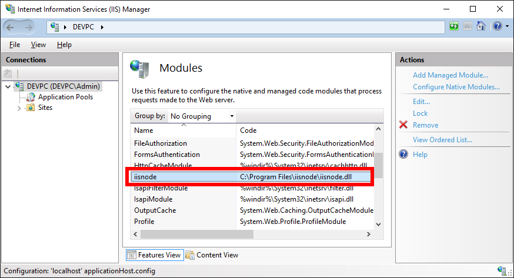

# ASP.NET Core with Node
Demonstrates how to host ASP.NET Core and Node side by side on same site. Works on local IIS and Azure. Does not work on IIS Express 10!

## Prerequisite
* .NET Core SDK 1.1 (https://www.microsoft.com/net/core#windowscmd)
* IIS Server with IISNode enabled
* Node.js installed

## How to enable IISNode on IIS Server?
Install IISNode with Web Platfrom Installer like this:

IIS with IISNode installed looks like this:

