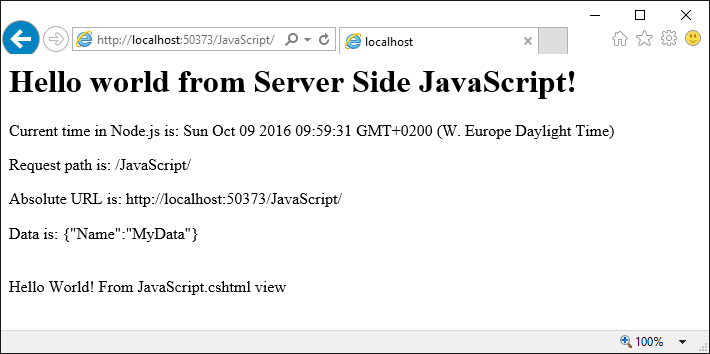

# ASP.NET Core Single Page Application with Node.js

Demonstrates ASP.NET Core calling JavaScript on server side via Node.js. Example tested on Windows and Ubuntu.

## Prerequisites
* Visual Studio 2015 or Visual Code
* Node.js installed (nodejs.org)
* Npm installed (npmjs.com)
* Run “npm install” in folder “WebApplication”. This will download “node_modules”.

Hint: For Ubuntu check node version in terminal with “node --version”. You might have to install “sudo apt install nodejs-legacy”.

