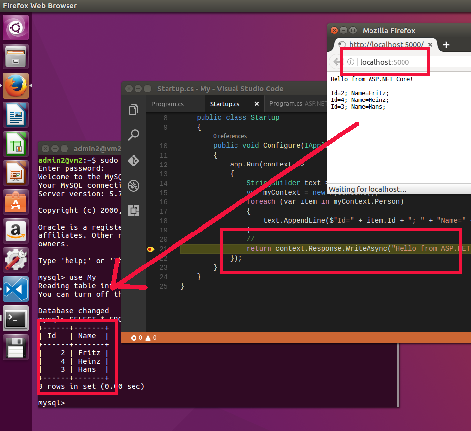

# ASP.NET and Entity Framework on Ubuntu

## Prerequisites
* .NET Core for Linux
* Visual Studio Code
* MySQL

Following screenshot shows ASP.NET application with Entity Framework and LINQ running on Ubuntu. It's reading data from MySQL server.

           
