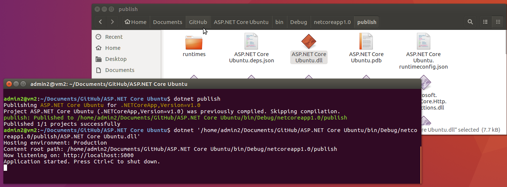

# ASP.NET Core and Entity Framework running on Ubuntu

## Prerequisites
* .NET Core for Linux
* Visual Studio Code
* MySQL

Following screenshot shows ASP.NET application with Entity Framework Core and LINQ running on Ubuntu. It's reading data from MySQL server.

## Publish Application
Run the following commands
* dotnet publish
* dotnet 'ASP.NET Core Ubuntu.dll'

           
