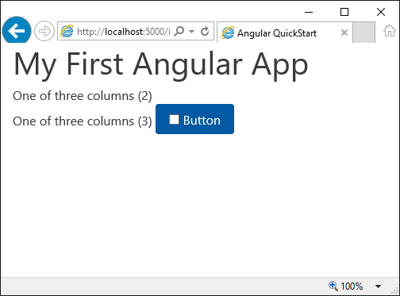

# Angular2 Application with Bootstarp
## Install
* cd wwwroot
* npm install
* npm run tsc

## Bootstarp
Modifications in package.json file
* @ng-bootstrap/ng-bootstrap (Used in main.ts file)
* bootstrap (css and js used in index.html file)

