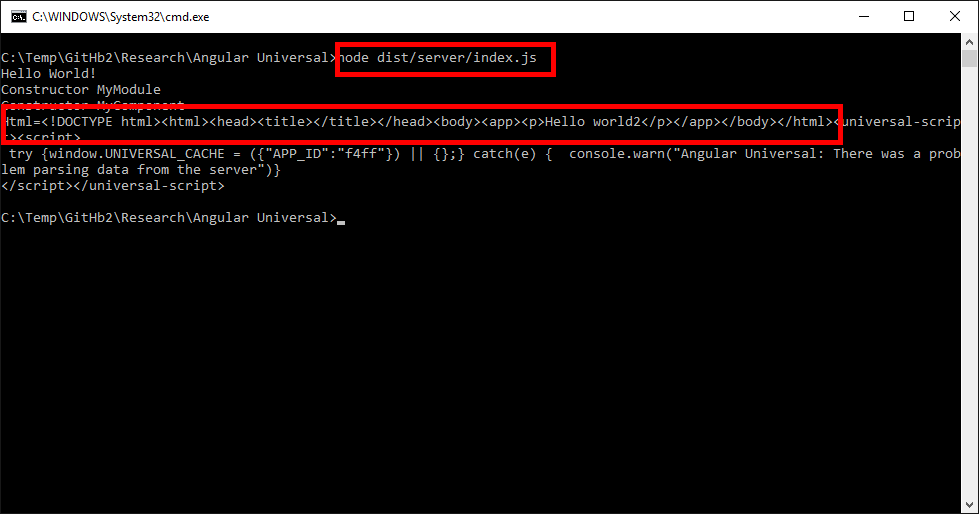

# Angular2 Server Side Rendering

Based on https://github.com/angular/universal-starter

## Modifications
* README.md renamed to README2.md
* New folder "src\app2"
* New file "src\app2\server2.ts" (Server side rendering)
* Changed file webpack.config.ts line 49 from "entry: './src/server'" to "entry: './src/app2/server2',"

## Install
* npm install (Downloads node_modules)
* npm run build:prod (Compile and build)

## Run
Run server side rendering on node
* node dist/server/index.js 
Outputs html 
