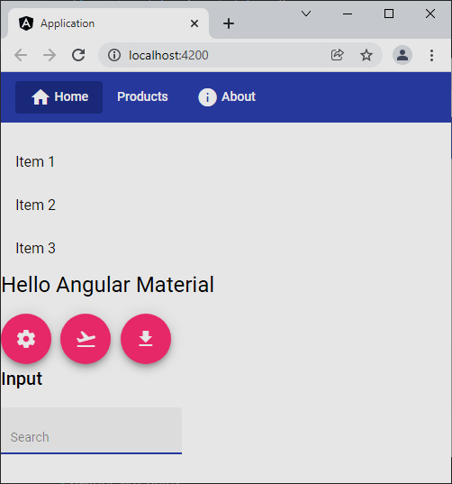

# Angular Material
Minimal layout


# Version
```
ng --version
```

* Angular CLI: 13.1.2

# Install
```
ng new application # No routing, Scss
ng add @angular/material # Global styles, animations
ng add @nguniversal/express-engine
npm run build:ssr
npm run serve:ssr
```

# Icons
https://fonts.google.com/icons