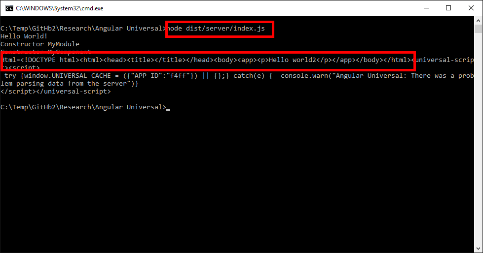

# Angular2 Server Side Rendering

Based on https://github.com/angular/universal-starter (2016-10-06)

## Modifications
* README.md renamed to README2.md
* New folder "Doc" (With screenshots)
* New folder "src\app2" (Here goes all new code)
* New file "src\app2\server2.ts" (Hello world server side node rendering)
* Change file webpack.config.ts line 49 from "entry: './src/server'" to "entry: './src/app2/server2',"
* Change file .gitignore line 14 add ".vscode/" 
* Change file package.json line 47 add "es6-promis: ^4.0.5",
* Delete file .editorconfig

## Install
* npm install (Downloads node_modules)
* npm run build:prod (Compile and build)

## Run
Run server side rendering on node
* node dist/server/index.js 

Html generated by Node on server side:
