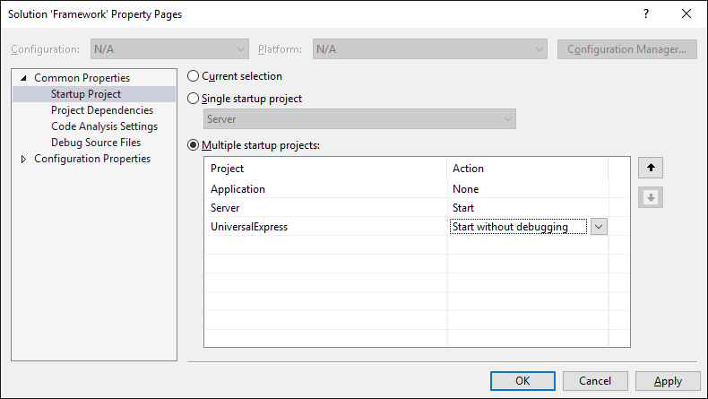
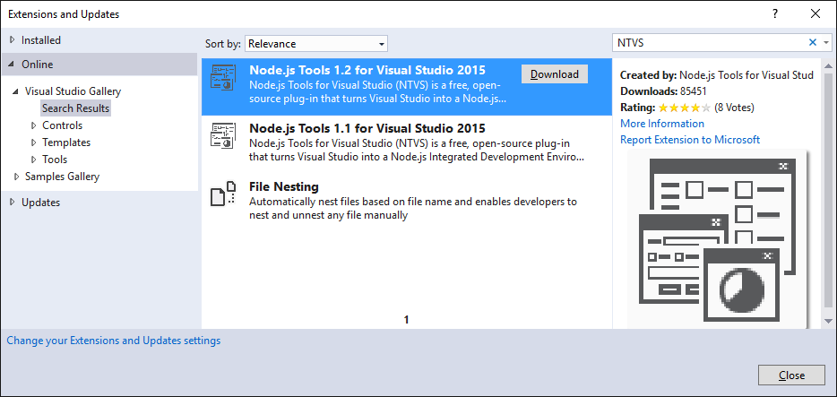

# Framework
Angular 2 with server side rendering and ASP.NET Core

## Install
* cd Build
* dotnet restore
* dotnet start
* 1=InstallAll
* 7=Start

## Visual Studio
* Open Framework.sln
* Configure multiple start up projects (Server, UniversalExpress)

## Folder
* Build (Build script)
* Application (Contains .NET Core business logic)
* Client (Angular 2 client)
* Server (ASP.NET Core server)
* Universal (Angular 2 server side rendering)
* UniversalExpress (Used for debug in Visual Studio. Runs Universal in Express server)

## Server

## UniversalExpress
