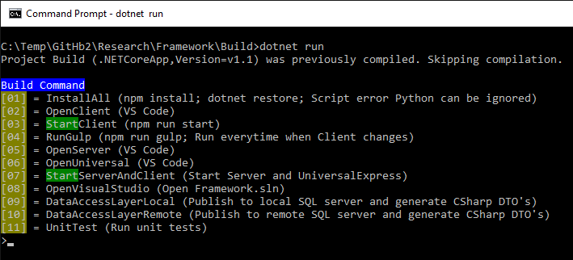

# Framework
Bundle to create applications based on Angular 2 with server side rendering, ASP.NET Core and SQL.

## Install
* cd Build
* dotnet restore
* dotnet start
* 01=InstallAll
* 07=StartServerAndClient

## Build CLI
Command line interface containing all scripts and tools.

## Visual Studio
* Open Framework.sln
* Configure multiple start up projects (Server, UniversalExpress)

## Folder
* Build (Build script with command line interface CLI)
* Application (Contains .NET Core business logic)
* Client (Angular 2 client)
* Server (ASP.NET Core server)
* Universal (Angular 2 server side rendering)
* UniversalExpress (Used for debug in Visual Studio. Runs Universal in Express server)

## Server

## UniversalExpress
