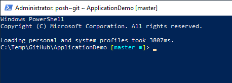

# Install PoshGit

See also: https://www.powershellgallery.com/packages/posh-git/0.7.3

Run PowerShell as administrator and run the following commands

```cmd
Set-ExecutionPolicy RemoteSigned
Install-Module -Name posh-git -RequiredVersion 0.7.1
Add-PoshGitToProfile
```
Adds git state visualization


