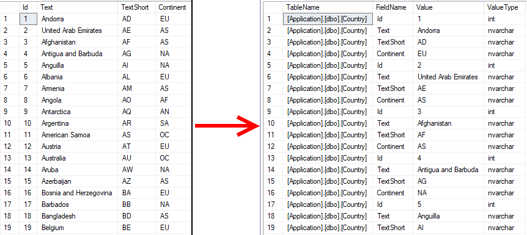

# Autoincrement
Select with calculated autoincrement:
```Sql
SELECT 
    ROW_NUMBER() OVER(ORDER BY(SELECT NULL)) AS Id 
FROM 
    Table
```

# Pivot Dynamic
Following sql turns any table or view into key value pair structure.

[PivotDynamic.sql](PivotDynamic.sql)



# Sql to Json
Following sql turns table to json.
```Sql
SELECT 1 AS Id, 'Hello' AS Text
UNION ALL
SELECT 2 AS Id, 'World' AS Text
FOR JSON PATH
```

# Sql from Json
Following sql turns json to sql table.

```Sql
DECLARE @json NVARCHAR(MAX)
SET @json =  
'[
  { "id" : 2,"info": { "name": "John", "surname": "Smith" }, "age": 25 },
  { "id" : 5,"info": { "name": "Jane", "surname": "Smith" }, "dob": "2005-11-04T12:00:00" }
]'
SELECT *
FROM OPENJSON(@json)
WITH
(
  id int 'strict $.id',  
  firstName nvarchar(50) '$.info.name',
  lastName nvarchar(50) '$.info.surname',
  age int, dateOfBirth datetime2 '$.dob'
)
```

# Sql view with delay
In order to test async operations it can be useful to intentionally slow down a sql view.
See: [WaitForDelay.sql](Delay/WaitForDelay.sql)