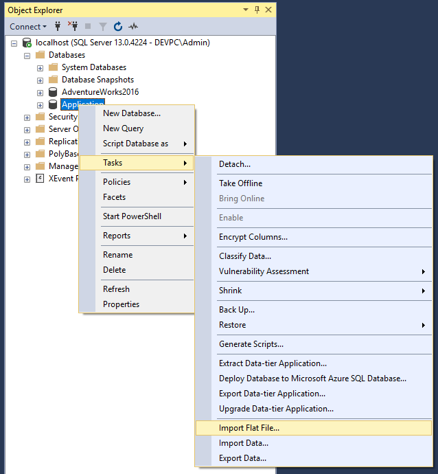
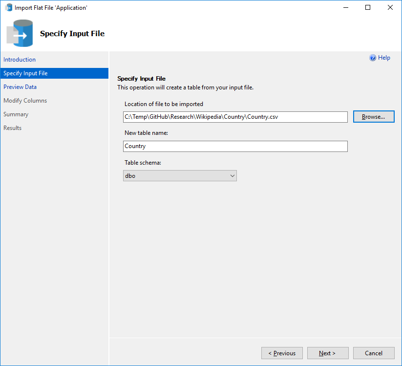
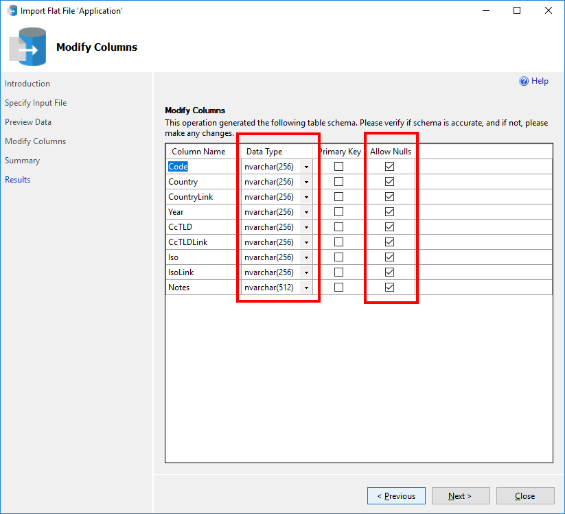
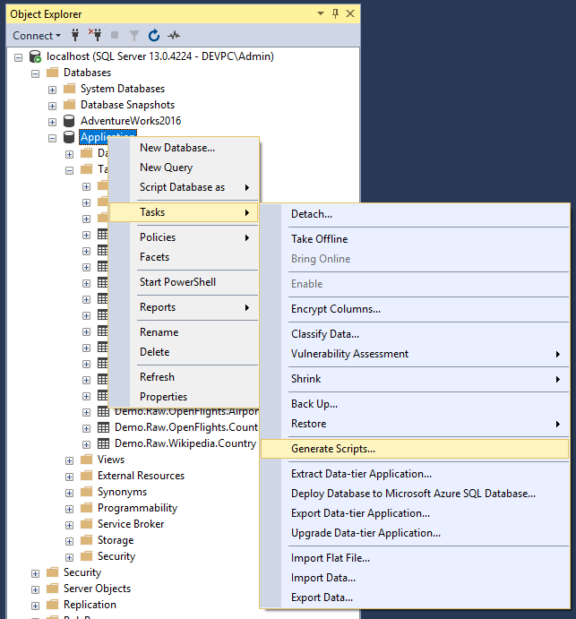
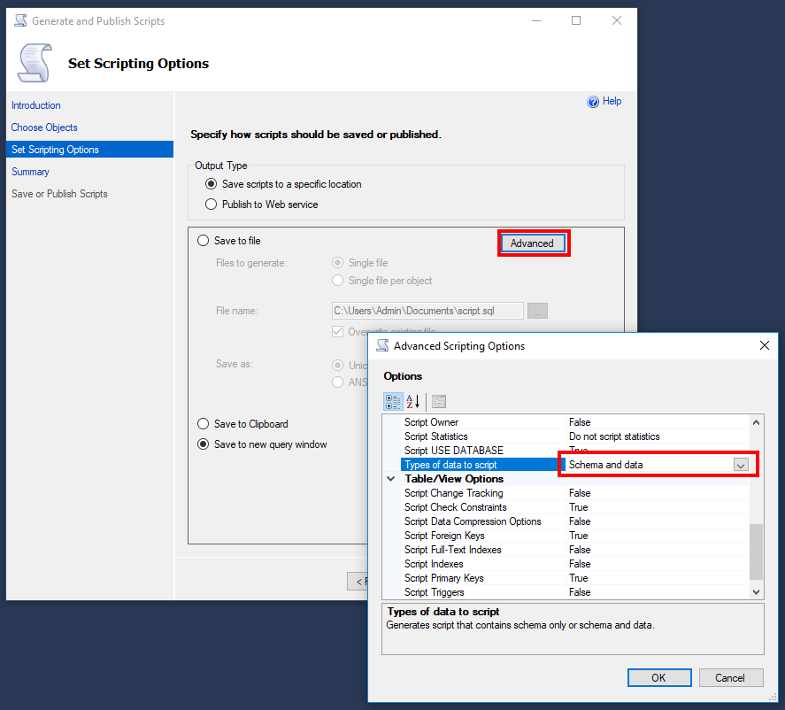
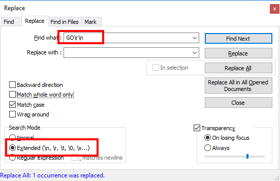

# Country List
Following article shows how to read country and aircraft list from Wikipedia and create a (*.sql) script. Program reads Wikipedia country list from 

* https://en.wikipedia.org/wiki/ISO_3166-1_alpha-2 (Country list)
* https://en.wikipedia.org/wiki/List_of_ICAO_aircraft_type_designators (Aircraft list)

and converts country and aircraft table to a (*.csv) file which can be loaded into a sql database. Program resolves also Wikipedia country and aircraft links.

## Country Columns
* Code
* Country
* CountryUrl (Wikipedia page)
* Year
* CcTLD
* CcTLDUrl (Wikipedia page)
* Iso
* IsoLink
* Notes

## Aircraft Columns
* IcaoCode
* IataCode
* Model
* ModelUrl (Wikipedia page)
* ModelTitle (Used alse for redirects)
* ModelImageUrl (Wikipedia image link)

# Import (*.csv) into sql server
Bulk import a (*.csv) file like this:

Straight forward bulk import for staging area without data type conversion:

# Export data from sql server to (*.sql) script
Export data table to (*.sql) script like this:

Remove GO statements with Notepad++

